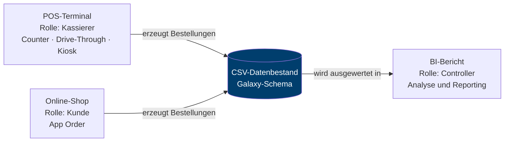

# 1 — Fachkonzept und Anforderungen

Dieses Kapitel beschreibt, welches Szenario BurgerMetrics abbildet und welche Anforderungen daraus für Datenbestand und Anwendungen folgen. Es steht am Anfang, weil alle späteren technischen Entscheidungen sich auf diese Anforderungen zurückführen lassen müssen.

---

## 1.1 Ausgangslage

Ein Lehrdatensatz für Business Intelligence muss zwei Bedingungen gleichzeitig erfüllen, die sich zunächst widersprechen.

Er muss **groß und unregelmäßig genug** sein, dass Auswertungen nicht trivial werden. Ein Datensatz mit tausend Zeilen und drei sauberen Dimensionen lässt sich überblicken, ohne dass ein Datenmodell nötig wäre — genau die Einsicht, um die es geht, entsteht dann nicht.

Er muss zugleich **vollständig nachrechenbar** sein. Wenn Studierende eine Kennzahl im Bericht anzweifeln, müssen sie den Rechenweg bis zur Quelle verfolgen können. Reale Unternehmensdaten scheiden damit aus: Sie unterliegen dem Datenschutz, dürfen nicht veröffentlicht werden und lassen sich nicht als Ganzes ausliefern.

Die Konsequenz ist ein **synthetischer, aber vollständig ausgelieferter Datenbestand**. Alles, was in einem Bericht steht, muss aus mitgelieferten Dateien reproduzierbar sein.

---

## 1.2 Das Szenario

BurgerMetrics GmbH ist eine fiktive Systemgastronomie-Kette mit acht Filialen in Würzburg. Das Szenario wurde bewusst so gewählt, dass es ohne Vorwissen zugänglich ist: Jeder kennt den Ablauf einer Bestellung im Schnellrestaurant. Die fachlichen Begriffe — Bestellung, Position, Filiale, Zahlungsart — müssen nicht erklärt werden und stehen dem eigentlichen Lerngegenstand nicht im Weg.

Der Betrachtungszeitraum umfasst **neun Jahre (2017–2026)** und bildet den Aufbau der Kette ab: Die erste Filiale eröffnet im März 2017, die achte im März 2023. Diese gestaffelte Eröffnung ist keine Beigabe, sondern erzeugt eine Anforderung an die Auswertung — absolute Filialumsätze sind ohne Normierung auf die Betriebsdauer nicht vergleichbar.

Drei Erfassungskanäle bilden das operative Geschäft ab:

| Kanal | Anteil | Erfassungssystem |
|-------|--------|------------------|
| Counter | 52,5 % | POS-Terminal |
| Drive-Through | 25,3 % | POS-Terminal |
| Kiosk | 16,3 % | Selbstbedienungsterminal |
| App Order | 5,9 % | Online-Bestellportal |

---

## 1.3 Leitfragen an den Datenbestand

Der Datenbestand wurde daraufhin entworfen, dass folgende Fragen beantwortbar sind. Sie strukturieren zugleich die Registerkarten des Berichts.

**Umsatz und Entwicklung** — Wie entwickeln sich Umsatz, Bestellmenge und Bestellwert über neun Jahre? Wo verlangsamt sich das Wachstum?

**Standorte** — Welche Filiale ist wie produktiv, wenn man auf Betriebsdauer, Fläche oder Sitzplätze normiert? Welchen Zusammenhang gibt es zwischen Miete und Umsatz?

**Sortiment** — Welche Produkte und Kategorien tragen welchen Umsatzanteil? Wie verschiebt sich das Sortiment über die Zeit?

**Kunden** — Wie verteilen sich Alter, Loyalty-Stufe und App-Nutzung? Welche Segmente tragen überproportional bei?

**Kanäle und Zahlung** — Wie verschiebt sich der Kanalmix? Wie entwickelt sich der Bargeldanteil?

**Zeitliche Muster** — Welche Wochentags-, Tageszeit- und Saisoneffekte gibt es? Wie wirken lokale Veranstaltungen?

**Warenkorb** — Welche Produkte werden gemeinsam gekauft, und wann ist ein solcher Zusammenhang belastbar?

**Externe Einflüsse** — Lässt sich ein Wettereinfluss auf den Tagesumsatz nachweisen, und wie trennt man ihn vom Wachstumstrend?

---

## 1.4 Anforderungen an die Muster in den Daten

Ein synthetischer Datensatz enthält nur die Muster, die man hineinlegt. Für die Lehre ist die Auswahl dieser Muster die eigentliche Entwurfsarbeit. Drei Kategorien wurden bewusst angelegt:

**Muster, die sich bestätigen lassen.** Wochentagseffekte, Mittagspeak, Saisonalität bei Eis und Heißgetränken, Bargeldrückgang. Sie belohnen sauberes Arbeiten mit einem klaren Ergebnis.

**Muster, die sich nur mit Sorgfalt zeigen.** Der Wettereffekt liegt unter einem starken Wachstumstrend; wer beides nicht trennt, sieht ihn nicht. Der Sommereinbruch am Universitätsstandort ist nur im Vergleich zum eigenen Jahresmittel sichtbar, nicht im Vergleich zu anderen Filialen.

**Scheinmuster, die einer Prüfung nicht standhalten.** Die Kombination Burger und Bier kommt in 12,7 % der Burger-Bestellungen vor. Das wirkt wie ein Zusammenhang, entspricht aber fast genau dem Bier-Anteil über alle Bestellungen (12,3 %) — der Lift beträgt 1,03. Wer nur Support und Konfidenz betrachtet, findet hier eine Regel, die keine ist.

Ebenso gehört dazu, dass manche versprochenen Muster **nicht** existieren: Die Kundenherkunft ist über alle zwölf Würzburger Stadtbezirke gleichverteilt, und die App-Nutzung liegt in allen acht Filialen zwischen 43 und 45 %. Eine Segmentierung nach Standort findet nichts. Auch das ist ein Ergebnis, und es korrekt zu berichten ist Teil der Aufgabe.

---

## 1.5 Anforderungen an die Anwendungen

Der Datenbestand allein zeigt nur das Ergebnis. Damit nachvollziehbar wird, **wie** die Daten entstehen, gehören drei Anwendungen dazu, die je eine Rolle im Unternehmen einnehmen:

Die Anforderung dahinter: Eine Kennzahl im Bericht soll bis zu dem Vorgang zurückverfolgbar sein, der sie erzeugt hat. Wer im Bericht sieht, dass der Drive-Through-Kanal einen höheren Bestellwert hat, soll im POS-Terminal nachvollziehen können, wie eine Drive-Through-Bestellung erfasst wird und welche Felder dabei entstehen.

---

## 1.6 Nicht-Ziele

Ebenso wichtig wie die Anforderungen ist, was das Projekt **nicht** leisten soll:

- **Keine Echtzeitverarbeitung.** Der Datenbestand ist ein Abzug, kein laufender Strom. Das entspricht der Ausgangslage einer periodisch beladenen Auswertungsdatenbank.
- **Keine Mehrmandantenfähigkeit, keine Rechteverwaltung.** Der Bericht ist öffentlich und zeigt allen dasselbe.
- **Keine vollständige ERP-Abbildung.** Einkauf, Lager und Schichtplanung sind im operativen Modell entworfen, aber nicht in den analytischen Datenbestand übernommen — siehe [Entscheidungsjournal](08-entscheidungen.md#e3).
- **Keine echten Personendaten.** Alle Kundenmerkmale sind generiert; der Datensatz enthält weder Namen noch Adressen einzelner Personen.

---

**Weiter:** [Datenmodell](02-datenmodell.md)
