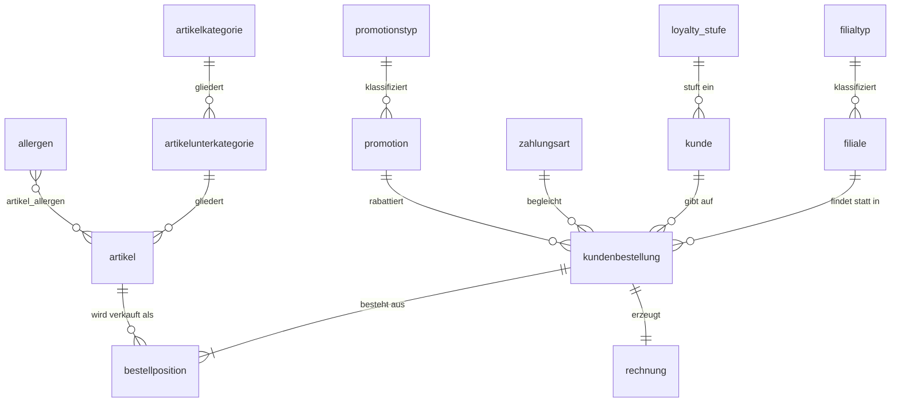
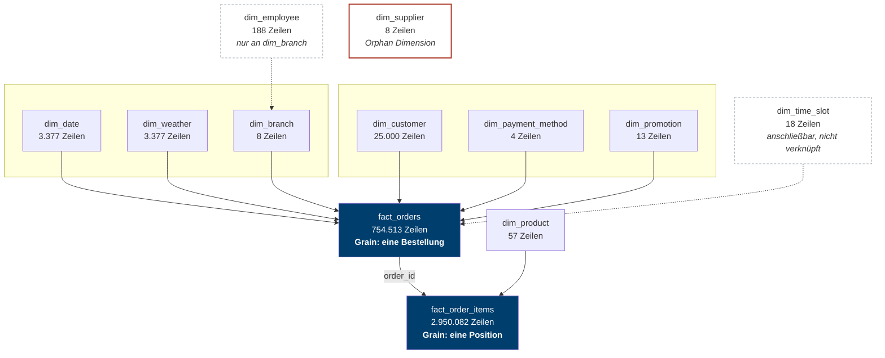
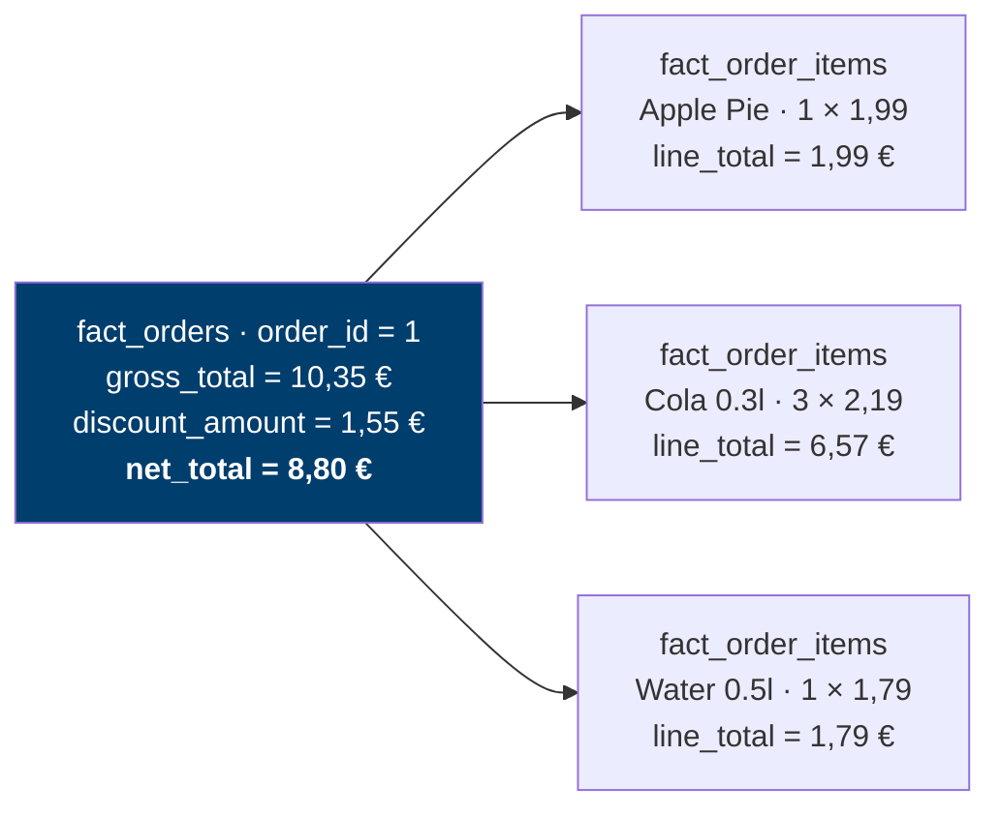

# 2 — Datenmodell

> Voraussetzung: [Fachkonzept und Anforderungen](01-fachkonzept.md)

Dieses Kapitel zeigt denselben Sachverhalt in zwei Modellierungen: einmal so, wie ihn ein operatives Warenwirtschaftssystem ablegt, und einmal so, wie ihn eine Auswertung braucht. Beide Modelle sind für ihren Zweck richtig. Der Übergang zwischen ihnen ist der eigentliche Lerngegenstand.

---

## 2.1 Das operative Modell (3NF)

Das Quellsystem ist als normalisiertes ERP-Modell entworfen und liegt als `dataset/erp_datenmodell.excalidraw` vor. Es umfasst **26 Tabellen in sieben fachlichen Bereichen**:

| Bereich | Tabellen |
|---------|----------|
| Stammdaten | `filiale`, `filialtyp`, `artikel`, `artikelkategorie`, `artikelunterkategorie`, `allergen`, `artikel_allergen`, `kunde`, `loyalty_stufe` |
| Einkauf und Lieferanten | `lieferant`, `lieferantenkategorie`, `einkaufsbestellung`, `einkaufsposition` |
| Lagerverwaltung | `lagerbestand`, `lagerbewegung` |
| Verkauf / POS | `kundenbestellung`, `bestellposition`, `preishistorie` |
| Finanzen und Zahlung | `zahlungsart`, `promotion`, `promotionstyp`, `rechnung` |
| Personal | `mitarbeiter`, `mitarbeiterrolle`, `schichtplan` |
| Externe Daten | `wetterdaten` |

Der Verkaufspfad, also der Ausschnitt, aus dem später die Faktentabellen entstehen:



Kennzeichen der dritten Normalform: Jedes Merkmal steht genau einmal. Die Kategorie eines Artikels liegt in `artikelkategorie`, nicht in `artikel`. Ändert sich ein Kategoriename, ist genau eine Zeile zu ändern.

Der Preis dafür zeigt sich bei der Auswertung. Die Frage „Umsatz je Artikelkategorie" verlangt bereits vier Verknüpfungen:

```sql
SELECT k.name AS kategorie,
       SUM(bp.menge * bp.einzelpreis) AS umsatz
FROM bestellposition bp
JOIN artikel               a  ON bp.artikel_id      = a.artikel_id
JOIN artikelunterkategorie u  ON a.unterkategorie_id = u.unterkategorie_id
JOIN artikelkategorie      k  ON u.kategorie_id     = k.kategorie_id
GROUP BY k.name;
```

---

## 2.2 Der Übergang: Denormalisierung mit Absicht

Die Faustregel aus DABA KE09 lautet: Konsistenz hat Vorrang im operativen System, Auswertungsgeschwindigkeit hat Vorrang im Auswertungssystem. Vertretbar wird die Redundanz dadurch, dass ein Auswertungsbestand **periodisch neu beladen** und nicht laufend fortgeschrieben wird. Änderungsanomalien, die im Schreibbetrieb entstehen könnten, treten dort gar nicht erst auf.

Konkret werden die drei Artikel-Tabellen zu einer breiten Dimension zusammengezogen:

| Operatives Modell (3NF) | Analytisches Modell | Begründung |
|---|---|---|
| `bestellposition` | `fact_order_items` | trägt Menge, Einzelpreis, Positionssumme — die Kennzahlen |
| `kundenbestellung` + `rechnung` | `fact_orders` | trägt Bestellwert, Rabatt, Dauer, Bewertung |
| `artikel` + `artikelkategorie` + `artikelunterkategorie` | `dim_product` | drei Tabellen werden eine; Kategorie steht danach redundant in jeder Produktzeile |
| `filiale` + `filialtyp` | `dim_branch` | Filialtyp wandert als Attribut in die Filialzeile |
| `kunde` + `loyalty_stufe` | `dim_customer` | Loyalty-Stufe wandert als Attribut in die Kundenzeile |
| `promotion` + `promotionstyp` | `dim_promotion` | analog |
| `zahlungsart` | `dim_payment_method` | unverändert übernommen |
| `mitarbeiter` + `mitarbeiterrolle` | `dim_employee` | analog |
| `wetterdaten` | `dim_weather` | unverändert übernommen |
| (nicht im Quellsystem) | `dim_date` | Kalenderdimension, künstlich erzeugt |

Aus 26 operativen Tabellen werden **2 Faktentabellen und 10 Dimensionstabellen**. Dieselbe Frage nach dem Umsatz je Kategorie braucht danach eine einzige Verknüpfung:

```sql
SELECT p.category,
       SUM(fi.line_total) AS umsatz
FROM fact_order_items fi
JOIN dim_product p ON fi.product_id = p.product_id
GROUP BY p.category;
```

Nicht übernommen wurden Einkauf, Lagerverwaltung, Preishistorie und Schichtplan. Sie gehören zum operativen Betrieb, tragen aber zu den Auswertungsfragen des Fachkonzepts nichts bei. Diese Auswahl ist eine bewusste Entscheidung und im [Entscheidungsjournal](08-entscheidungen.md#e3) begründet.

---

## 2.3 Das analytische Modell: Galaxy-Schema

Ein Stern-Schema hat definitionsgemäß **eine** Faktentabelle. BurgerMetrics hat zwei, die sich Dimensionen teilen. Diese Form heißt **Galaxy-Schema** oder **Fact Constellation**. Sie ist die naheliegende Erweiterung des Stern-Schemas, sobald ein Sachverhalt auf zwei Granularitätsebenen gemessen wird.



### Kennzahlen und Attribute

| | Faktentabelle | Dimensionstabelle |
|---|---|---|
| Inhalt | messbare Kennzahlen: `net_total`, `quantity`, `line_total`, `discount_amount` | beschreibende Attribute: `branch_name`, `category`, `loyalty_tier`, `season` |
| Schlüssel | Fremdschlüssel auf alle angeschlossenen Dimensionen | eigener Schlüssel als Primärschlüssel |
| Größe | viele Zeilen, wenige Spalten — hier liegt das Datenvolumen | wenige Zeilen, viele Spalten — bewusst breit |
| Aufgabe | die feinste erfasste Ebene | liefert die Achsen zum Filtern und Gruppieren |

---

## 2.4 Granularität: die wichtigste Entscheidung

Die beiden Faktentabellen messen auf verschiedenen Ebenen. Eine Zeile in `fact_orders` beschreibt **eine Bestellung**, eine Zeile in `fact_order_items` **eine Position innerhalb einer Bestellung**. Im Mittel enthält eine Bestellung 3,91 Positionen.

Bestellung 1 aus dem Datenbestand, vollständig:



An diesem Beispiel lässt sich eine zweite Eigenschaft ablesen: Die drei Positionssummen ergeben 10,35 € und damit **`gross_total`, nicht `net_total`**. Der Rabatt von 1,55 € ist auf Bestellebene erfasst und hat in den Positionen keine Entsprechung. Wer Positionssummen mit Bestellwerten vergleicht, muss also zusätzlich wissen, auf welcher Ebene der Rabatt hängt.

Daraus folgt die häufigste Fehlerquelle im Umgang mit diesem Datensatz. Wer beide Faktentabellen verknüpft und anschließend `net_total` summiert, zählt den Bestellwert einmal je Position:

```sql
-- FALSCH: net_total wird je Position wiederholt und dadurch mehrfach gezählt
SELECT SUM(o.net_total)
FROM fact_orders o
JOIN fact_order_items i ON o.order_id = i.order_id;
-- Ergebnis: 70.809.660,60 € statt 14.522.378,70 €
```

Der Wert ist um den Faktor **4,88** zu hoch — nicht um 3,91, den Durchschnitt der Positionen je Bestellung. Der Unterschied entsteht, weil Bestellungen mit vielen Positionen im Mittel auch einen höheren Wert haben und beim Vervielfachen entsprechend stärker durchschlagen. Wer den Fehler über den Faktor 3,91 zurückrechnen wollte, läge erneut daneben.

Der Effekt heißt **Fan Trap**: Der Join vervielfacht die Faktenzeilen entlang der 1:n-Beziehung. Die Regel dagegen ist einfach — Kennzahlen nur auf der Granularität aggregieren, auf der sie erfasst wurden:

```sql
-- RICHTIG: Bestellwerte aus fact_orders, Mengen aus fact_order_items
SELECT SUM(net_total) FROM fact_orders;          -- 14.522.378,70 €
SELECT SUM(line_total) FROM fact_order_items;    -- Positionssummen
```

---

## 2.5 Bewusst eingebaute Modellierungsschwächen

Drei Dimensionen sind absichtlich nicht sauber angebunden. Sie sind Diskussionsmaterial, keine Versäumnisse.

**`dim_supplier` ist eine Orphan Dimension.** Es gibt keinen `supplier_id`-Fremdschlüssel, weder in den Faktentabellen noch in `dim_product`. Die Tabelle steht im Schema und hängt an nichts. Im operativen Modell existiert die Beziehung sehr wohl — über `lieferant` → `einkaufsbestellung` → `einkaufsposition` → `artikel`. Beim Übergang ins analytische Modell wurde der Einkaufspfad nicht übernommen, und damit verlor der Lieferant seinen Anschluss. Das ist ein realistischer Befund: In gewachsenen Auswertungssystemen finden sich solche Reste regelmäßig.

**`dim_employee` hängt nur an `dim_branch`.** In `fact_orders` gibt es keine `employee_id`. Die Frage „Welcher Mitarbeiter hat welchen Umsatz erwirtschaftet?" lässt sich deshalb nicht beantworten — nicht wegen fehlender SQL-Kenntnis, sondern weil die Granularität der Faktentabelle diese Zuordnung nicht enthält. Beantwortbar bleibt „Wie viele Mitarbeiter hat welche Filiale?".

**`dim_time_slot` ist anschließbar, aber nicht angeschlossen.** `fact_orders.hour` und `dim_time_slot.hour` passen zusammen, ein Join ist möglich. Genutzt wird die Dimension nirgends; die One Big Table führt `hour`, nicht `time_slot`.

---

## 2.6 Die One Big Table als dritte Modellierung

Neben dem Galaxy-Schema liegt `obt_orders.csv` bereit: 754.513 Zeilen mit 41 Spalten, in denen alle Dimensionsattribute bereits eingebettet sind. Die Granularität ist die der Bestellung; `fact_order_items` geht bewusst nicht ein, weil ein Join auf Positionsebene die Bestellungen vervielfachen würde.

| Kriterium | Galaxy-Schema | One Big Table |
|---|---|---|
| Abfrage „Umsatz je Filiale und Jahr" | zwei Verknüpfungen nötig | keine Verknüpfung nötig |
| Speicherbedarf | 135 MB über 12 Dateien | 176 MB in einer Datei |
| Änderung einer Filialadresse | eine Zeile in `dim_branch` | 754.513 Zeilen betroffen |
| Produktanalysen | über `fact_order_items` möglich | nicht möglich, Positionen fehlen |
| Einstiegshürde | Verständnis von Joins nötig | sofort auswertbar |

Die OBT ist damit kein besseres oder schlechteres Modell, sondern eine andere Abwägung: Sie senkt die Einstiegshürde und erhöht den Pflegeaufwand. Der Laufzeitvergleich beider Varianten ist Block E des [Übungsblatts](../dataset/uebungsblatt.md).

---

## 2.7 Was fehlt: Historisierung

Das Modell kennt keine Slowly Changing Dimensions. Ändert ein Kunde seine Loyalty-Stufe, überschreibt der nächste Ladelauf den alten Wert — eine Auswertung „Umsatz zum Zeitpunkt der Bestellung nach damaliger Stufe" ist nicht möglich. `dim_product` enthält mit `base_price_2017` und `unit_price` immerhin zwei Preisstände, das operative Modell hat mit `preishistorie` eine vollständige Historie, die beim Übergang nicht übernommen wurde.

Für die Auswertungsfragen des Fachkonzepts ist das ausreichend. Als Übungsaufgabe eignet sich die Frage, welche Dimension eine Historisierung bräuchte und welcher SCD-Typ dafür angemessen wäre.

---

**Weiter:** [ETL-Strecke und Reproduzierbarkeit](03-etl.md)
