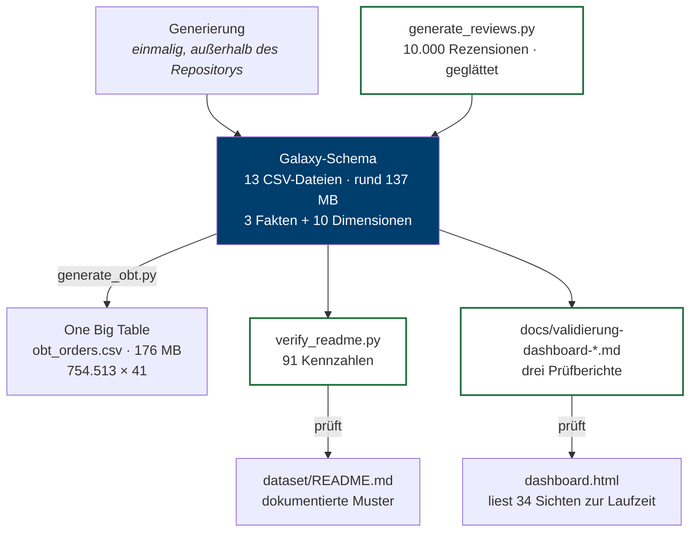

# 3 — ETL-Strecke und Reproduzierbarkeit

> Voraussetzung: [Datenmodell](02-datenmodell.md)

Dieses Kapitel beschreibt, wie die ausgelieferten Dateien entstehen und welche Vorkehrungen dafür sorgen, dass sie reproduzierbar bleiben. Reproduzierbarkeit ist hier keine Formalie: Der gesamte Anspruch des Projekts — jede Zahl im Bericht ist nachrechenbar — steht und fällt damit, dass sich der Datenbestand aus seinen Bausteinen erneut erzeugen lässt.

---

## 3.1 Die Strecke im Überblick



Zwei Dinge fallen auf. Erstens ist die **Generierung der Bestellungen nicht Teil des Repositorys** — die CSV-Dateien sind die Quelle der Wahrheit, nicht ein Generatorskript. Bei den Rezensionen ist das anders: Seit September 2026 erzeugt `dataset/generate_reviews.py` sie im Repository, die Texte wurden anschließend geglättet (`fact_reviews_roh.csv` → `fact_reviews.csv`, [Entscheidung E10](08-entscheidungen.md#e10)). Zweitens gibt es **zwei getrennte Prüfstrecken**: eine für die Datensatz-Dokumentation, eine für den Bericht.

---

## 3.2 Warum die Generierung der Bestellungen nicht im Repository liegt

Das ist eine bewusste Entscheidung mit einem Nachteil, den man kennen sollte.

**Dafür spricht:** Die CSV-Dateien sind das Lehrmaterial. Studierende sollen mit einem festen, unveränderlichen Datenbestand arbeiten — dieselben Kontrollzahlen für alle, über Semester hinweg. Läge ein Generator bei, entstünde die Frage, ob er nach einer Änderung neu laufen müsste, und jede Zahl in jeder Übungsaufgabe stünde zur Disposition.

**Dagegen spricht:** Die eingebauten Muster lassen sich nicht mehr nachlesen, sondern nur noch aus den Daten rekonstruieren. Wer wissen will, wie stark der Wettereffekt angelegt wurde, muss ihn messen statt im Code nachzuschlagen.

Der zweite Punkt wird dadurch aufgefangen, dass alle Muster in [`dataset/README.md`](../dataset/README.md) mit nachgerechneten Werten dokumentiert und über `verify_readme.py` überprüfbar sind. Die Dokumentation tritt an die Stelle des Generators.

Für die Rezensionen gilt diese Abwägung nicht in gleicher Form: Seit September 2026 erzeugt `dataset/generate_reviews.py` sie im Repository, die Texte wurden anschließend geglättet (`fact_reviews_roh.csv` → `fact_reviews.csv`, [Entscheidung E10](08-entscheidungen.md#e10)).

---

## 3.3 Die One Big Table erzeugen

`dataset/generate_obt.py` ist die Transformation für die One Big Table. Sie erzeugt die denormalisierte Tabelle aus den Schema-Dateien:

```bash
cd dataset
python generate_obt.py                 # schreibt obt_orders.csv
python generate_obt.py /pfad/test.csv  # alternatives Ziel, für Prüfläufe
```

Der Kern ist ein expliziter Spaltenvertrag. Welche Dimension welche Attribute beisteuert und über welchen Fremdschlüssel sie hängt, steht als Datenstruktur im Skript und nicht verstreut in Aufrufen:

```python
DIMENSIONS = [
    ("dim_branch.csv", "branch_id", [
        "branch_name", "district", "branch_type", "has_drive_through", "opening_date",
    ]),
    ("dim_customer.csv", "customer_id", [
        "age_group", "gender", "has_app", "loyalty_tier", "home_district",
    ]),
    # ... payment, promotion, date, weather
]
```

Die Reihenfolge dieser Liste bestimmt die Spaltenreihenfolge der Ausgabe. Laufzeit: rund 9 Sekunden.

### Drei eingebaute Prüfungen

Das Skript bricht ab, statt stillschweigend falsche Daten zu erzeugen:

```python
# 1. Fehlende Spalten — schlägt fehl, statt eine leere Spalte anzulegen
missing = [c for c in [key] + columns if c not in dim.columns]
if missing:
    raise SystemExit(f"FEHLER: {filename} fehlen die Spalten: {', '.join(missing)}")

# 2. Mehrdeutige Dimensionsschlüssel — der Fan Trap aus Kapitel 2
if dim[key].duplicated().any():
    raise SystemExit(f"FEHLER: {filename} hat mehrdeutige Schlüssel in '{key}'")

# 3. Zeilenzahl-Drift — ein LEFT JOIN darf die Faktenzeilen nicht vermehren
if len(obt) != fact_rows:
    raise SystemExit(f"FEHLER: Join mit {filename} hat die Zeilenzahl verändert")
```

Die zweite Prüfung ist die wichtigste. Ein LEFT JOIN auf eine Dimension mit doppeltem Schlüssel vervielfacht Faktenzeilen — und zwar lautlos. Das Ergebnis sieht plausibel aus und ist falsch. Die Zeilenzahl-Prüfung fängt denselben Fehler ein zweites Mal ab, falls die Schlüsselprüfung umgangen wird.

### Der Umgang mit Textwerten

Alle Dateien werden als Text eingelesen:

```python
pd.read_csv(path, encoding="utf-8-sig", dtype=str, keep_default_na=False)
```

Das ist Absicht. Die Spalte `loyalty_tier` enthält für 15.339 Kunden den **Literal-String `"None"`**. Mit den pandas-Standardeinstellungen wird daraus ein fehlender Wert, und beim Schreiben ein leeres Feld — die Information ginge still verloren. Ebenso bleibt `discount_pct` als `"15"` statt `"15.0"` erhalten und `net_total` als `"8.8"` statt `"8.800000000000001"`.

Für eine reine Denormalisierung ist der Texttransport verlustfrei. Typisiert wird erst im auswertenden Werkzeug.

---

## 3.4 Der Nachweis: byte-identische Reproduktion

Eine ETL-Strecke gilt als reproduzierbar, wenn sie aus derselben Eingabe dieselbe Ausgabe erzeugt. Für die OBT ist dieser Nachweis geführt:

```
Original: 185.011.332 Bytes   md5 7c1effc682de8a57501f1c9c2abbbfee
Neu:      185.011.332 Bytes   md5 7c1effc682de8a57501f1c9c2abbbfee
```

Das ist ein schärferes Kriterium als „die Zahlen stimmen". Byte-Identität schließt auch Abweichungen in Spaltenreihenfolge, Zahlenformatierung, Zeilenenden und Zeichenkodierung aus.

Erreicht wird sie durch drei Festlegungen: `encoding="utf-8-sig"` (UTF-8 mit BOM, Excel-kompatibel), `lineterminator="\n"` (LF, unabhängig vom Betriebssystem) und der Texttransport aus Abschnitt 3.3.

Ohne die LF-Festlegung erzeugt ein Lauf unter Windows CRLF, und dieselbe Datei erscheint gegenüber einem macOS-Lauf als vollständig geändert.

### Warum das nicht selbstverständlich war

Vor der Überarbeitung im August 2026 erzeugte das Skript eine **andere** Tabelle als die ausgelieferte. Drei Ursachen:

| Fehler | Wirkung |
|---|---|
| Aggregation von `fact_order_items` in Spalten `products`, `categories`, `has_vegetarian` | Diese Spalten existieren in `obt_orders.csv` nicht. Ein Join auf Positionsebene wäre zudem fachlich falsch. |
| `if "date_id" in dim_weather.columns` | Nie wahr — `dim_weather` ist über `date` verschlüsselt. Der Wetter-Join wurde stillschweigend übersprungen, obwohl die Datei Temperatur und Wetterlage enthält. |
| `dim_branch` lieferte `seats_indoor`/`seats_outdoor`, verlor `opening_date` | Spalten, die die OBT nicht hat, gegen eine, die sie hat. |

Der zweite Fehler ist der lehrreichste: Eine Bedingung, die nie zutrifft, erzeugt keine Fehlermeldung. Der Code lief durch, die Ausgabe war unvollständig, und niemandem fiel es auf, weil die ausgelieferte Datei ja korrekt war. Erst der Abgleich zwischen Skript und Artefakt brachte es ans Licht.

Daraus folgt eine allgemeine Regel für Datenpipelines: **Eine Transformation, deren Ergebnis nie gegen ein erwartetes Artefakt geprüft wird, driftet unbemerkt.**

---

## 3.5 Große Dateien: Git LFS

Der Datenbestand umfasst rund 315 MB (15 Dateien), davon allein 176 MB in `obt_orders.csv`. Solche Dateien gehören nicht in die reguläre Git-Historie: Git speichert jede Version vollständig, und binäre Änderungen lassen sich nicht zusammenführen.

Deshalb sind alle CSV-Dateien über **Git LFS** verwaltet. In `.gitattributes` steht:

```
*.csv filter=lfs diff=lfs merge=lfs -text
```

Im Repository liegt je Datei ein Verweis von rund 130 Byte:

```
version https://git-lfs.github.com/spec/v1
oid sha256:deef61177fc57b004e792f5e72c400b5fb2658c665af107930253e8a25060e8d
size 53346072
```

Der Inhalt liegt getrennt davon im LFS-Speicher. Das Muster `*.csv` enthält keinen Schrägstrich und greift deshalb auf jeder Verzeichnisebene — die Umstellung auf die Ordnerstruktur `dataset/` ließ die LFS-Verwaltung unberührt.

**Praktische Folge für Mitarbeitende:** Wer das Repository ohne installiertes `git-lfs` klont, erhält Verweisdateien statt Daten. Umgekehrt gilt: Wer bei fehlendem `git-lfs` einen Commit erzeugt, schreibt rund 315 MB (15 Dateien) Rohdaten in die Historie. Vor der ersten Arbeit am Repository also:

```bash
git lfs install
git lfs fsck        # prüft die Vollständigkeit der Objekte
```

---

## 3.6 Was für einen produktiven Betrieb fehlen würde

Die Strecke ist auf einen unveränderlichen Lehrdatensatz zugeschnitten. Für einen laufenden Betrieb fehlten:

- **Inkrementelles Laden.** Es gibt kein Konzept für Deltas; die OBT wird immer vollständig neu erzeugt. Bei 754.513 Zeilen in 9 Sekunden ist das unproblematisch, bei täglichem Zuwachs nicht.
- **Ladeprotokoll und Zeitstempel.** Die Dateien tragen nicht, wann sie erzeugt wurden.
- **Fehlerbehandlung jenseits des Abbruchs.** Das Skript bricht ab; es gibt keine Quarantäne für fehlerhafte Sätze.
- **Orchestrierung.** Kein Scheduler, keine Abhängigkeitsverwaltung. Für eine Strecke aus einem Schritt ist das angemessen.

Diese Lücken sind geeignete Erweiterungsaufgaben — insbesondere die Frage, welcher der Punkte bei welchem Datenvolumen zuerst schmerzt.

---

**Weiter:** [Validierung](04-validierung.md)
