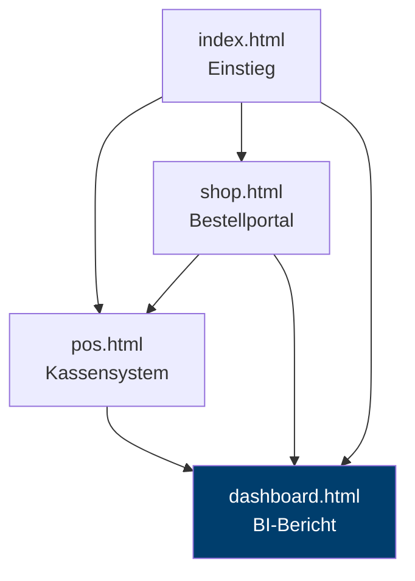

# 5 — Anwendungsarchitektur

> Voraussetzung: [Validierung](04-validierung.md)

Drei Webanwendungen bilden je eine Rolle im Unternehmen ab. Dieses Kapitel beschreibt ihren Aufbau und begründet die durchgehende Bauweise: eine Datei je Anwendung, keine Build-Werkzeuge, keine Serverlogik.

---

## 5.1 Überblick

| Datei | Rolle | Zeilen | Externe Bibliotheken |
|---|---|---:|---|
| `web/index.html` | Einstieg, Orientierung | 416 | Font Awesome |
| `web/pos.html` | Kassierer am Tresen | 1.729 | Font Awesome |
| `web/shop.html` | Kunde im Bestellportal | 5.574 | Font Awesome, Leaflet |
| `web/dashboard.html` | Controller, Analyse | 3.299 | Chart.js + 2 Plugins |



Die Navigation ist unvollständig: `dashboard.html` verlinkt auf keine andere Seite, und keine Unterseite führt zurück zum Einstieg. Der Befund ist bekannt und im [Entscheidungsjournal](08-entscheidungen.md#offene-punkte) als offener Punkt vermerkt.

---

## 5.2 Warum eine Datei je Anwendung

Jede Anwendung ist eine einzelne HTML-Datei mit eingebettetem CSS und JavaScript. Das ist ungewöhnlich für Anwendungen dieser Größe — `shop.html` umfasst 5.574 Zeilen — und war eine bewusste Wahl.

**Dafür sprach:** Studierende sollen die Anwendung vollständig lesen können. Eine Datei öffnen und alles sehen, was passiert, ohne Modulauflösung, ohne Bundler, ohne `node_modules`. Wer den Bericht verstehen will, liest ihn — von der Datenkonstante bis zur Diagrammdefinition. Zusätzlich läuft jede Datei per Doppelklick, ohne Installation, auf jedem Rechner. Dasselbe Prinzip verwenden die DABA-Kurseinheiten.

**Der Preis:** Keine Wiederverwendung zwischen den Anwendungen. Das Farbschema ist in jeder Datei erneut definiert; eine Änderung an den Grundfarben ist an vier Stellen zu machen. Bei größerem Umfang wäre das nicht mehr vertretbar.

Die Abwägung fällt hier zugunsten der Lesbarkeit aus, weil die Anwendungen Lehrmaterial sind und nicht weiterentwickelt werden sollen.

---

## 5.3 Der Bericht

`dashboard.html` ist die umfangreichste der drei Anwendungen: 13 Registerkarten der ersten Ebene, darunter eine zweite Navigationsebene, insgesamt **41 Diagramme**.

### Daten zur Laufzeit aus der Semantikschicht

Im Quelltext des Berichts steht **keine Nutzdatenzahl**: keine Datenreihe, kein Kachelwert, kein Text der Management Summary. Beim Aufruf lädt die Seite 33 Sichten der Semantikschicht (`db/aufbau/0005` bis `0015`) über PostgREST und baut daraus 91 Datenreihen, 72 Kacheln und 30 Summary-Karten — in rund drei Sekunden. Die CSV-Dateien liest der Bericht nach wie vor nicht; er liest deren Abbild in der Datenbank.

Die Arbeit ist auf vier Module in `web/js/` verteilt: `konfiguration.js` kennt als einzige Datei eine Adresse, `datenquelle.js` ist der Vertrag aus benannten Fragen, `reihen.js` übersetzt die Antworten in die Form, die Chart.js erwartet, `kacheln.js` und `texte.js` füllen Kennzahlen und Deutungstexte. Der Bericht kennt keine Tabelle, keine Spalte und keinen Join — nur die Namen der Sichten.

Bis August 2026 war das anders: Alle Werte standen als JavaScript-Konstanten in der Datei, weil ein Browser 176 MB CSV nicht verarbeiten kann und ohne Server das Laden lokaler Dateien an den Sicherheitsregeln scheitert. Der Preis war, dass die Werte von den Daten abweichen konnten, ohne dass es auffiel — die Prüfstrecke aus [Kapitel 4](04-validierung.md) existierte genau deshalb, und beim Umbau fielen zwei falsche Werte auf, die sie nicht erwischt hatte (`categoryRevenue` etwa zur Hälfte zu niedrig). Die Entscheidung und ihre Rücknahme stehen im [Entscheidungsjournal](08-entscheidungen.md#e5).

Die ehrliche Beschreibung lautet jetzt: Der Bericht ist ein **Fenster auf die Semantikschicht**, und die ist so aktuell wie der letzte Lauf von `db/materialisieren.py`. Die Sichten sind auf dem Server materialisiert, weil 33 gleichzeitige Aggregationen über 2,95 Millionen Positionen die Zeitgrenze der Rolle `anon` rissen; die Begründung steht in [`db/README.md`](../db/README.md). Was der Bericht damit nicht mehr kann: per Doppelklick ohne Netz laufen. Ohne Verbindung zur Datenbank zeigt er den Fehlerschirm, keine alten Zahlen.

### Diagramme werden verzögert erzeugt

Nicht alle 41 Diagramme entstehen beim Laden. Sieben davon hängen an der zweiten Navigationsebene und werden erst beim Aufruf der jeweiligen Unterseite erzeugt:

```javascript
if (item.id === 'sub_kunden_herkunft' && !window._lazySubInited.kundenHerkunft) {
    window._lazySubInited.kundenHerkunft = true;
    createDistrictChart();
}
```

Beim Laden entstehen 25 Diagramme, nach dem Durchlaufen der Hauptnavigation 34, nach dem Öffnen aller Unterseiten alle 41. Wer die Anwendung testet, muss beide Navigationsebenen bedienen — sonst sieht ein leeres Diagramm wie ein Fehler aus, obwohl es nur noch nicht erzeugt wurde.

### Bibliotheken

| Bibliothek | Version | Zweck |
|---|---|---|
| Chart.js | 4.5.1 | sämtliche Diagramme |
| chartjs-plugin-datalabels | 2.2.0 | Wertebeschriftung in den Diagrammen |
| chartjs-plugin-annotation | 3.1.0 | Referenzlinien und Markierungen |

---

## 5.4 POS-Terminal

`pos.html` bildet die Erfassung an der Kasse nach: Artikel wählen, Warenkorb füllen, Zahlungsart wählen, Bon erzeugen, Tagesabschluss als CSV exportieren.

Der didaktische Kern ist ein zuschaltbares Feld, das zu jedem Bedienschritt zeigt, **welche Daten dabei entstehen** — im Markup als `.pos-data-annotation` angelegt und standardmäßig ausgeblendet. Wer einen Artikel bucht, sieht die entstehende Zeile in `wawi.bestellposition`; wer die Bestellung abschließt, sieht den Beleg in `wawi.kundenbestellung`.

Die Daten entstehen nicht nur auf dem Bildschirm. Bei jeder Zahlung schreibt die Kasse den Beleg in das operative Schema `wawi` — Bestellung, Positionen und Rechnung in einer Transaktion, über die Datenbankfunktion `bestellung_anlegen()`. Der Browser schickt Artikelnummern, Mengen, Zahlart und Rabatt; die Preise nimmt die Funktion aus dem Artikelstamm. Die Belegnummer, die zurückkommt, steht unter dem Bon. Der Artikelstamm selbst kommt aus demselben Schema (`v_speisekarte`).

Damit schließt sich der Kreis zum Datenmodell: Die Granularität aus [Kapitel 2](02-datenmodell.md#24-granularität-die-wichtigste-entscheidung) wird an der Kasse sichtbar, wo sie entsteht — und der Weg von dort ins Auswertungsmodell ist der ETL-Schritt aus `db/aufbau/0019`, nicht mehr eine Behauptung.

---

## 5.5 Online-Shop

`shop.html` bildet die Kundensicht ab: Speisekarte, Warenkorb, Filialkarte, Bestellabschluss. Auch hier gibt es die zuschaltbare Datenansicht.

Speisekarte und Filialliste kommen aus dem Schema `wawi`, dieselbe Quelle wie an der Kasse. Auch die Filialauswahl im Warenkorb wird daraus gebaut; vorher stand sie mit eigenen Nummern im HTML, und Filiale 1 war dort der Hauptbahnhof, in der Datenbank aber der Europastern. Der Bestellabschluss schreibt die Bestellung über dieselbe Funktion wie die Kasse (`bestellkanal = 'App Order'`) und zeigt die Nummer, die die Datenbank vergibt — an die Stelle der früheren Zufallsnummer `BM-2024-######`.

Die Filialkarte nutzt **Leaflet 1.9.4** mit den acht Geokoordinaten aus `dim_branch.csv`. Sie ist die einzige Stelle im Projekt, an der Kartenmaterial von einem externen Dienst geladen wird.

---

## 5.6 Abhängigkeiten von externen Diensten

Alle Bibliotheken werden zur Laufzeit von öffentlichen CDNs geladen, jeweils auf eine exakte Version festgelegt:

```html
<script src="https://cdn.jsdelivr.net/npm/chart.js@4.5.1/dist/chart.umd.min.js"></script>
<link rel="stylesheet" href="https://cdnjs.cloudflare.com/ajax/libs/font-awesome/7.3.1/css/all.min.css">
<script src="https://unpkg.com/leaflet@1.9.4/dist/leaflet.js"></script>
```

Daraus folgen zwei Eigenschaften, die man kennen sollte:

**Die Anwendungen brauchen eine Internetverbindung.** Ohne sie fehlen Diagramme, Symbole und Karte. Das steht in einem gewissen Widerspruch zum Anspruch „läuft per Doppelklick" und wäre durch lokale Kopien der Bibliotheken auflösbar.

**Es gibt keine Subresource Integrity.** Die Einbindungen tragen kein `integrity`-Attribut. Ein verändertes Auslieferungspaket auf dem CDN würde ungeprüft ausgeführt. Für ein Lehrprojekt ohne Anmeldung und ohne personenbezogene Daten ist das Risiko begrenzt, es ist aber eine echte Lücke — und selbst ein lohnendes Unterrichtsthema.

---

**Weiter:** [Betrieb und Auslieferung](06-betrieb.md)
