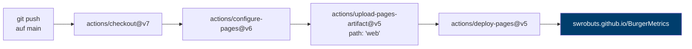

# 6 — Betrieb und Auslieferung

> Voraussetzung: [Anwendungsarchitektur](05-anwendungen.md)

---

## 6.1 Aufbau des Repositorys

```
BurgerMetrics/
├── web/          index.html · pos.html · shop.html · dashboard.html
├── dataset/      13 CSV-Dateien (LFS) · generate_obt.py · verify_readme.py
│                 README.md · uebungsblatt.md · uebungsblatt.pdf
│                 erp_datenmodell.excalidraw
├── docs/         diese Dokumentation · zwei Prüfberichte
├── .github/workflows/static.yml
├── .gitattributes
└── .gitignore
```

Die Trennung folgt der Frage, wer was braucht: `web/` wird veröffentlicht, `dataset/` wird heruntergeladen und lokal ausgewertet, `docs/` wird gelesen.

Bis August 2026 lagen alle Dateien flach im Wurzelverzeichnis, und der Datenbestand existierte zusätzlich in einem zweiten, nicht versionierten Ordner. Übungsblatt, ERP-Modell und Datensatz-Dokumentation waren dadurch für Studierende unsichtbar — sie standen nicht im Repository.

---

## 6.2 Auslieferung über GitHub Pages



Der entscheidende Parameter ist `path: 'web'`. Der Ablauf lädt **nur das Web-Verzeichnis** hoch, nicht das gesamte Repository.

Das war nicht immer so. Ursprünglich stand dort `path: '.'`, mit zwei Folgen:

**Das Auslieferungspaket umfasste 311 MB CSV-Daten**, die von der veröffentlichten Seite nirgends verlinkt werden. Nach der Umstellung sind es rund 530 KB.

**Die CSV-Dateien wären als Verweisdateien ausgeliefert worden.** `actions/checkout` holt ohne `lfs: true` nur die LFS-Verweise, nicht die Inhalte. Wer eine CSV-Datei von der veröffentlichten Seite geladen hätte, hätte 130 Byte Text statt der Daten erhalten — ein Fehler, der erst beim Öffnen der Datei auffällt.

Die Umstellung auf `path: 'web'` behebt beides in einem Schritt: Da keine CSV-Dateien mehr in der Auslieferung sind, ist die LFS-Frage gegenstandslos. Wer die Daten braucht, holt sie aus dem Repository, wo LFS korrekt greift.

---

## 6.3 Versionsstände der Abhängigkeiten

Stand August 2026, jeweils gegen die Registry geprüft:

| Abhängigkeit | Version | Anmerkung |
|---|---|---|
| Chart.js | 4.5.1 | |
| chartjs-plugin-datalabels | 2.2.0 | |
| chartjs-plugin-annotation | 3.1.0 | |
| Leaflet | 1.9.4 | |
| Font Awesome | 7.3.1 | Hauptversionswechsel von 6 |
| actions/checkout | v7 | |
| actions/configure-pages | v6 | |
| actions/upload-pages-artifact | v5 | |
| actions/deploy-pages | v5 | |

Der Wechsel von Font Awesome 6 auf 7 verdient eine Anmerkung, weil er stillschweigend hätte fehlschlagen können. Version 7 stellte den Mechanismus um: statt

```css
.fa-check:before { content: "\f00c"; }
```

steht dort nun eine CSS-Custom-Property:

```css
.fa-check { --fa: "\f00c"; }
```

Solange eine Anwendung die Symbole nur über Klassennamen einbindet, ist der Wechsel unsichtbar. Sobald eigenes CSS die Pseudo-Elemente überschreibt, bricht die Darstellung — ohne Fehlermeldung. Vor dem Wechsel wurde deshalb geprüft, dass alle 69 verwendeten Symbolklassen in Version 7 existieren, dass keine Kurzschreibweise aus Version 5 verwendet wird und dass kein projekteigenes CSS an den Pseudo-Elementen hängt.

---

## 6.4 Prüfung vor der Auslieferung

Die Anwendungen haben keine automatisierte Testsuite. Vor einem Versionswechsel wird gegen einen lokalen Server geprüft:

```bash
cd web && python3 -m http.server 8731
```

Geprüft wird im Browser über das DOM statt per Augenschein:

```javascript
// Alle Diagramme erzeugt?
const cv = [...document.querySelectorAll('canvas')];
({ gesamt: cv.length, erzeugt: cv.filter(c => Chart.getChart(c)).length })

// Symbole korrekt aufgelöst?
[...document.querySelectorAll('i[class*="fa-"]')].filter(el => {
    const cs = getComputedStyle(el, '::before');
    return !/Font Awesome/i.test(cs.fontFamily || '');
}).length
```

Beim Versionswechsel im August 2026 wurde zusätzlich eine **Vergleichsmessung** durchgeführt: Eine unveränderte Kopie mit den alten Bibliotheksversionen durchlief denselben Ablauf. Beide Läufe ergaben 41 von 41 Diagrammen und keine JavaScript-Fehler — womit belegt ist, dass der Wechsel das Verhalten nicht verändert.

Ohne diese Vergleichsmessung wäre offen geblieben, ob ein Befund am Versionswechsel liegt oder schon vorher bestand. Beim ersten Durchlauf waren sieben Diagramme leer; erst die Vergleichsmessung zeigte, dass dies auch mit den alten Versionen so war — Ursache war die verzögerte Erzeugung aus [Kapitel 5](05-anwendungen.md#diagramme-werden-verzögert-erzeugt), nicht der Wechsel.

---

## 6.5 Arbeit am Repository

**Vor der ersten Änderung:**

```bash
git lfs install          # ohne dies landen 311 MB Rohdaten in der Historie
git lfs fsck             # prüft die Vollständigkeit der LFS-Objekte
git config core.fileMode false   # bei Ablage in OneDrive/iCloud
```

Die dritte Zeile betrifft eine Eigenheit von Cloud-Synchronisation: Sie kann Dateirechte verändern (644 → 755), woraufhin Git jede Datei als geändert meldet, obwohl der Inhalt gleich ist.

**Nach Änderungen am Datenbestand:**

```bash
cd dataset
python generate_obt.py       # OBT neu erzeugen
python verify_readme.py      # 79 Angaben nachrechnen, Exit-Code prüfen
```

---

## 6.6 Bekannte Einschränkungen

| Punkt | Bewertung |
|---|---|
| Keine automatisierte Prüfung der Anwendungen | Vor jedem Bibliothekswechsel manuelle Browser-Prüfung nötig |
| Keine Subresource Integrity | CDN-Einbindungen ungeprüft; siehe [Kapitel 5](05-anwendungen.md#56-abhängigkeiten-von-externen-diensten) |
| Anwendungen brauchen Internetzugang | Bibliotheken werden zur Laufzeit geladen |
| `dashboard.html` ohne Rücknavigation | Bekannter offener Punkt |
| Berichtswerte fest eingetragen | Abweichung von den Daten nur über die Prüfstrecke erkennbar |

---

**Weiter:** [Lehrbezug DABA und BINT](07-lehrbezug.md)
